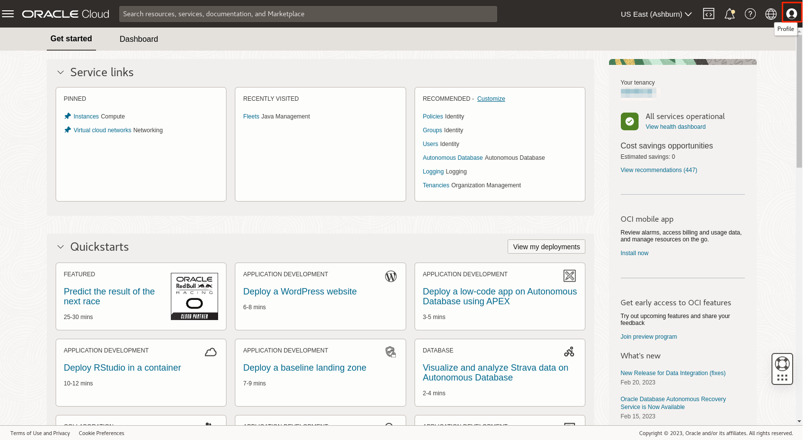
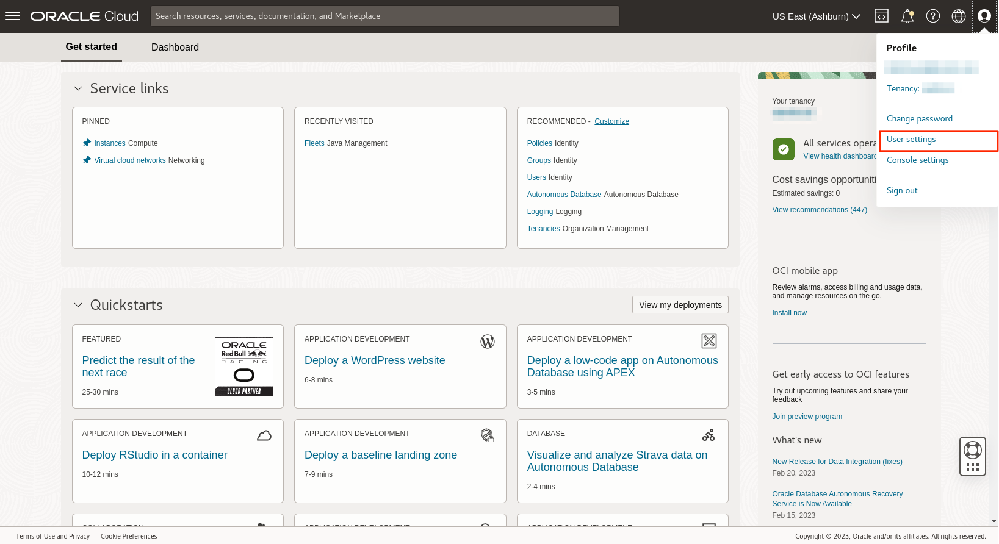
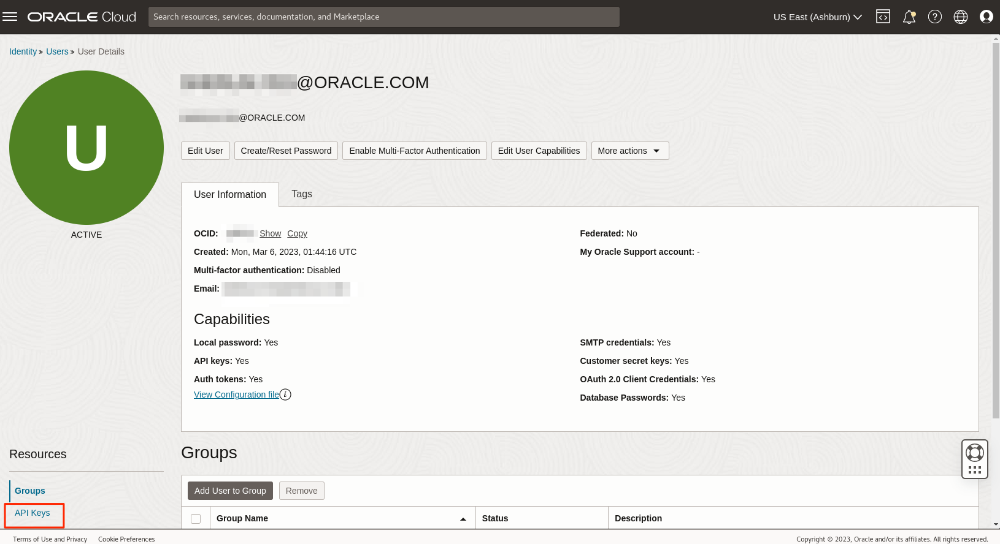
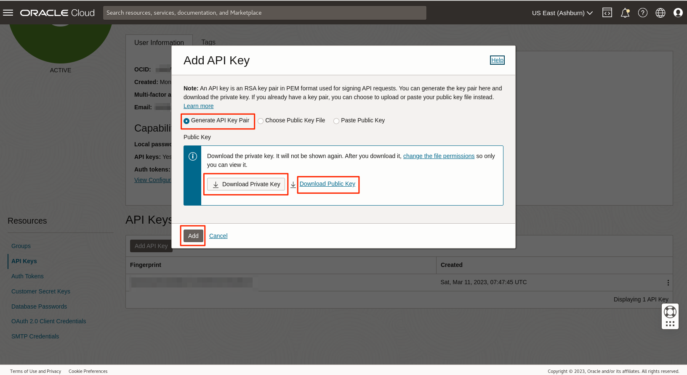
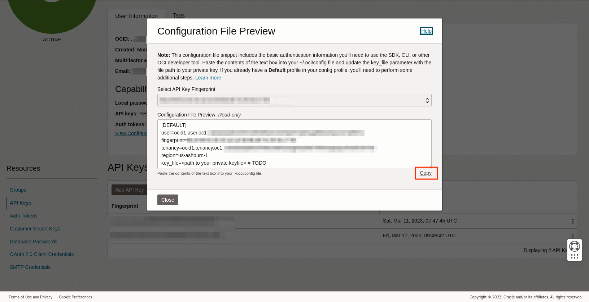
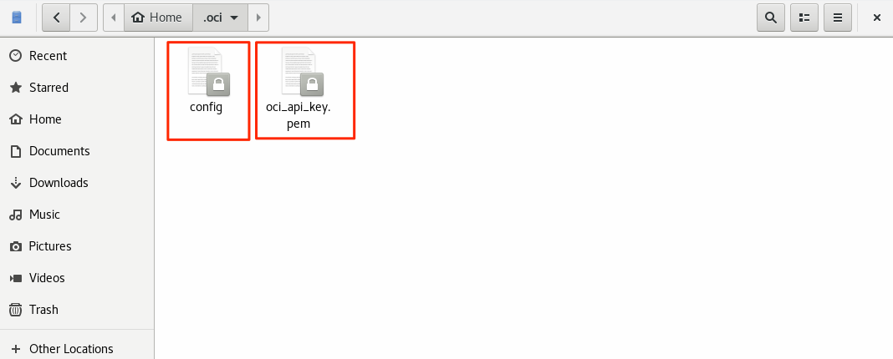
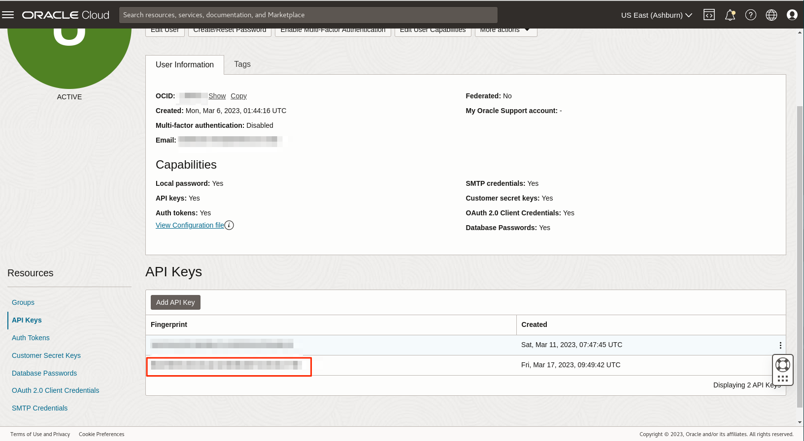
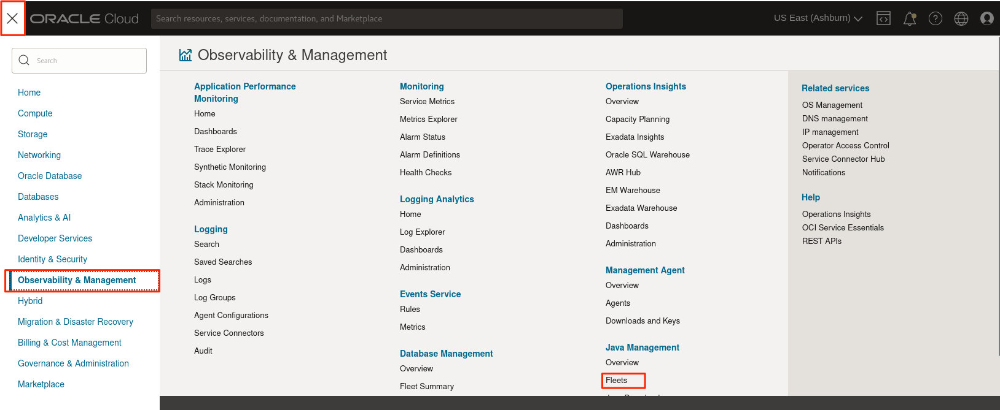
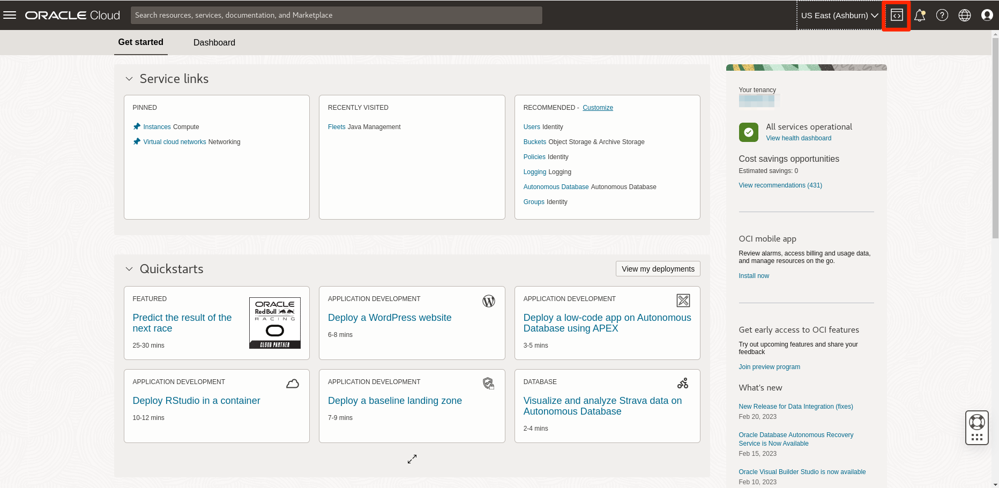
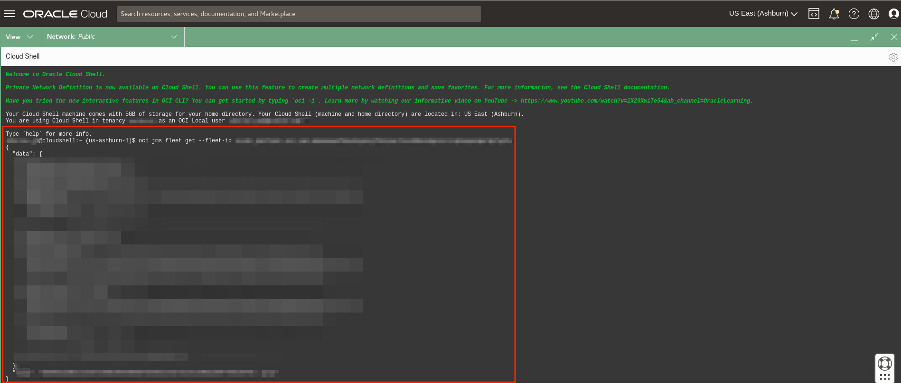

# Access and utilise REST API via OCI CLI and Cloud Shell

## Introduction

This lab walks you through the steps to set up the configuration on your local host machine to access Java Management Service (JMS) REST APIs via OCI CLI.

Estimated Time: 10 minutes

### Objectives

In this lab, you will:

* Generate an API Signing Key
* Install Oracle Cloud Interface (OCI)
* Access REST API via OCI CLI
* Access REST API via Cloud Shell

### Prerequisites

* You have signed up for an account with Oracle Cloud Infrastructure and have received your sign-in credentials.
* You are using an Oracle Linux image on your host machine or compute instance for this workshop.
*  Python version 3.6 and later is installed on your local machine

## Task 1: Generate an API Signing Key

1. If you have generated your own keys, refer to the public documentation on how to [upload them](https://docs.oracle.com/en-us/iaas/Content/API/Concepts/apisigningkey.htm) and the public key fingerprint.

2. Open the Profile menu, click the **Profile icon** and click User Settings.

  

    > **Note:** If **User Settings** is not indicated under Profile, Click **My Profile**.

    

3. Click **API Keys**.

  

4. Click **Add API Key**.

  

5. Download private and public key. Click **Add**.

  

6. The key is added and the **Configuration File Preview** is displayed. Click **Copy** to copy the file snippets and paste it into a text file, using a text editor. Replace `<path to your private keyfile>` and save the file as **config**.

7. The file snippet includes required parameters and values you'll need to create your configuration file. Refer to the [SDK and CLI Configuration File](https://docs.oracle.com/en-us/iaas/Content/API/Concepts/sdkconfig.htm) to see an example of the configuration file and `key_file` entry.

  

8. Create a folder called **.oci** in the Home directory and save the **config file** and **private key** there.

  

9. Set the root user to have **Read-only** permissions for the config file and private key. No other user should have permissions.

  

  Alternatively, you may use the Terminal to change the permissions.

      ```
      <copy>
      sudo chmod 400 <config-file-name>
      </copy>
      ```

10. An API Key is successfully created.

  


## Task 2: Install OCI Command Line Interface (CLI)

#### For Linux and Unix

Open a terminal.

To run the installer script, run the following command.
  ```
  <copy>
  bash -c "$(curl -L https://raw.githubusercontent.com/oracle/oci-cli/master/scripts/install/install.sh)"
  </copy>
  ```
Respond to the Installation Script prompts.

#### For Oracle Linux 8

Use dnf to install the CLI.
  ```
  <copy>
  sudo dnf -y install oraclelinux-developer-release-el8
  sudo dnf install python36-oci-cli
  </copy>
  ```
#### For Oracle Linux 7

Use yum to install the CLI.
  ```
  <copy>
  sudo yum install python36-oci-cli
  </copy>
  ```

#### Mac OS X
To install the CLI on Mac OS X with [Homebrew](https://docs.brew.sh/Installation):

  ```
  <copy>
  brew update && brew install oci-cli
  </copy>
  ```
#### Windows
Open the PowerShell console using the **Run as Administrator** option.

The installer enables auto-complete by installing and running a script. To allow this script to run, you must enable the RemoteSigned execution policy.

To configure the remote execution policy for PowerShell, run the following command.

  ```
  <copy>
  Set-ExecutionPolicy RemoteSigned
  </copy>
  ```

Force PowerShell to use TLS 1.2 for Windows 2012 and Windows 2016: [Net.ServicePointManager]::SecurityProtocol = [Net.SecurityProtocolType]::Tls12

Download the installer script:
  ```
  <copy>
  Invoke-WebRequest https://raw.githubusercontent.com/oracle/oci-cli/master/scripts/install/install.ps1 -OutFile install.ps1
  </copy>
  ```

Run the installer script with or without prompts:
To run the installer script with prompts, run the following command:
  ```
  <copy>
  iex ((New-Object System.Net.WebClient).DownloadString('https://raw.githubusercontent.com/oracle/oci-cli/master/scripts/install/install.ps1'))
  </copy>
  ```
To run the installer script without prompting the user, accepting the default settings, run the following command:
  ```
  <copy>
  install.ps1 -AcceptAllDefaults
  </copy>
  ```

#### Verify that CLI is installed

To get a namespace, run the following command.
  ```
  <copy>
  oci os ns get
  </copy>
  ```

If successful, the following will be returned, with xx as your unique namespace.

  ```
  {
    "data": "xx"
  }
  ```
## Task 3: Access REST API via OCI CLI

 1. Obtain the **fleet OCID** before accessing the REST API via OCI CLI.

  * In the Oracle Cloud Console, open the navigation menu, click **Observability & Management**, and then click **Fleets** under **Java Management**.

  

  * Select the compartment and then the fleet. Refer to Workshop 1 if you have not setup a Fleet yet.

  

  * Copy the fleet OCID.

  
<!--  -->

2. Open a Terminal or Command Prompt window.

  To get **fleet information**, run the following command.

    ```
    <copy>
    oci jms fleet get --fleet-id "<fleet_OCID>"
    </copy>
    ```

  To get **jre usage**, run the following command.

    ```
    <copy>
    oci jms jre-usage summarize --fleet-id "<fleet_OCID>"
    </copy>
    ```

  To get **application usage**, run the following command.

    ```
    <copy>
    oci jms application-usage summarize --fleet-id "<fleet_OCID>"
    </copy>
    ```

## Task 4: Access REST API via OCI Cloud Shell

 Alternatively, you can use OCI **Cloud Shell**. It is a web browser-based terminal accessible from the Oracle Cloud Console. Cloud Shell provides access to a Linux shell, with a pre-authenticated Oracle Cloud Infrastructure CLI, and other useful pre-installed tools like SQL command line. We are going to access REST API via Cloud shell CLI.

 1. Login to the OCI Console. 

 2. Click the Cloud Shell icon in the Console header. This icon is accessible from mostly all the OCI Console pages.

  

  The Cloud Shell will open and may look something like this.
  

  You can use the icons in the upper right corner of the Cloud Shell window to minimize, maximize, and close your Cloud Shell session. 
  


 3. In Cloud Shell add the following to get the fleet details. You should have access to fleet_OCID from the last task.
    ```
    <copy>
    oci jms fleet get --fleet-id "<fleet_OCID>"
    </copy>
    ```
    

 

4. You should be able to see the response something like this.
  


5. Similarly, you can try a few more REST API commands

  To get jre usage, run the following command.

    ```
    <copy>
    oci jms jre-usage summarize --fleet-id "<fleet_OCID>"
    </copy>
    ```
  To get application usage, run the following command.

    ```
    <copy>
    oci jms application-usage summarize --fleet-id "<fleet_OCID>"
    </copy>
    ```


Refer to the [Using Cloud Shell](https://docs.oracle.com/en-us/iaas/Content/API/Concepts/cloudshellgettingstarted.htm) to learn more about Cloud Shell and various operations which it can perform.

You may now **proceed to the next lab.**

## Learn More

* If you encounter further issues, review the [Troubleshooting](https://docs.oracle.com/en-us/iaas/jms/doc/troubleshooting.html#GUID-2D613C72-10F3-4905-A306-4F2673FB1CD3) page.

* Alternatively, you may seek help for
    * [API Key](https://docs.oracle.com/en-us/iaas/Content/API/Concepts/apisigningkey.htm)
    * [Using the CLI](https://docs.oracle.com/en-us/iaas/Content/API/SDKDocs/cliusing.htm)
    * You may review [Getting Help and Contacting Support](https://docs.oracle.com/en-us/iaas/Content/GSG/Tasks/contactingsupport.htm) in the OCI documentation.
    * If you are still unable to resolve your issue, you may open a support service request using the **Help** menu in the OCI console.

## Acknowledgements

* **Author** - Esther Neoh, Java Management Service
* **Last Updated By** - Bao Jin Lee, November 2022
